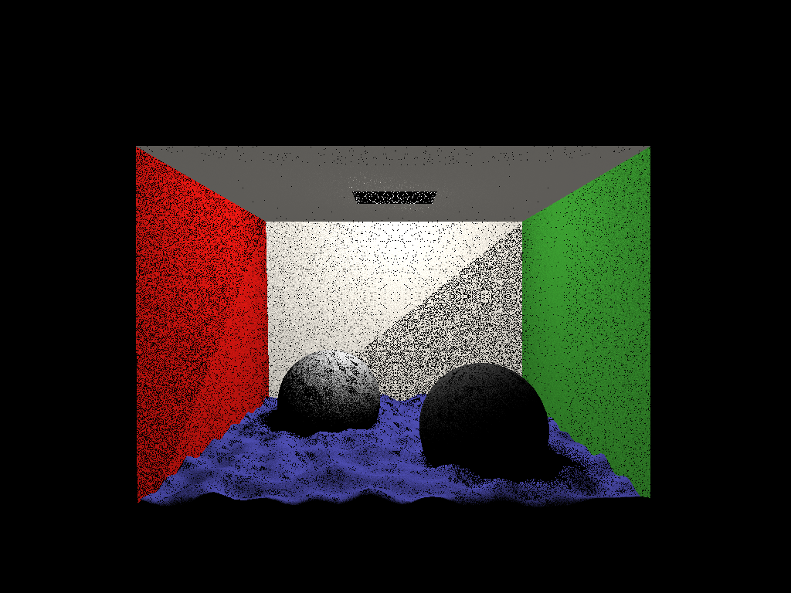

# parallel-raytracer

Exploring different methods of optimizing a raytracing algorithm.
* simple parallelization
* parallelization with queue
* flattening the data structure representing the scene
* bounding volume hierarchy
* parallelization of the BVH construction

The application of all this methods achieved a combined speed-up of over
291x. Reducing the execution time from 99933ms to 343ms. 

Al the performance analysis where performed on the [SeARCH cluster @ UMinho](https://www4.di.uminho.pt/search/pt/)
while rendering a Cornell Box scene filled with water.

## Authors

* [João Teixeira](https://github.com/jtexeira)
* [José Filipe Ferreira](https://github.com/JoseFilipeFerreira)

## License

This project is licensed under the MIT License - see the [LICENSE](LICENSE) file
for details
